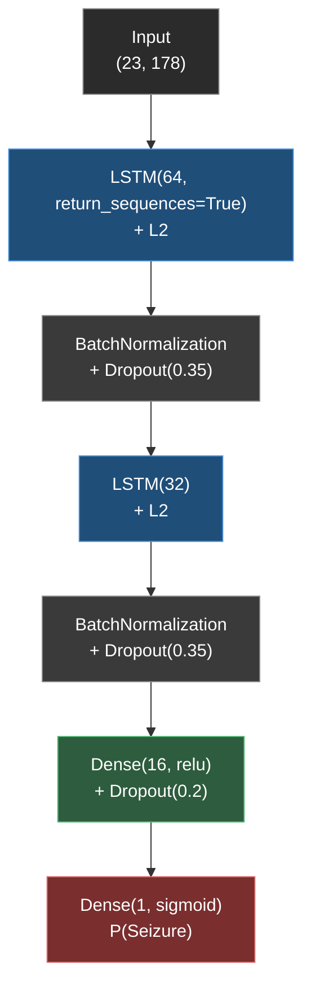

# 🧠 DeepIctal-Bonn

**LSTM-based epileptic seizure detection on the Bonn University EEG dataset**

---

## 📖 Overview

DeepIctal-Bonn is a reproducible deep learning pipeline that classifies single-channel EEG
recordings from the **Bonn University EEG dataset** into **Normal/Interictal** and
**Ictal/Seizure** classes using a **Long Short-Term Memory (LSTM)** network.

The pipeline covers the full lifecycle: signal ingestion → windowed tensor construction →
leakage-safe grouped splitting → LSTM training with class-imbalance handling →
recall-oriented threshold tuning → evaluation → reporting.

> 📄 **Full methodology, derivations, and discussion:** **[Read the complete report →](reports/report.pdf)**
>
> 📓 **Interactive walkthrough:** **[Open the Jupyter notebook →](DeepIctal_Bonn.ipynb)**

---

## 🧩 Dataset & Class Mapping

| Class | Label | Bonn Set(s) | Description |
|:-----:|:-----:|:-----------:|:-------------|
|  Ictal / Seizure | `1` | **S** | Intracranial recordings during active seizure |
|  Normal / Interictal | `0` | **Z, O, N, F** | Healthy volunteers + seizure-free intracranial recordings |

- **Recordings:** 500 total (100 per set)
- **Class balance (recording-level):** 400 vs. 100 (≈ 4.0 : 1)
- **Sampling rate:** 173.61 Hz · **Duration:** ~23.6 s/recording (4097 points)

---

## ⚙️ Methodology

<table>
<thead>
<tr><th align="center">#</th><th align="left">Stage</th><th align="left">What happens</th><th align="left">Why</th></tr>
</thead>
<tbody>
<tr>
<td align="center">1️⃣</td>
<td><b>Windowing</b></td>
<td>Reshape each recording to <code>(23, 178)</code></td>
<td>LSTM unrolls 23 steps instead of 4097, avoiding vanishing gradients</td>
</tr>
<tr>
<td align="center">2️⃣</td>
<td><b>Micro-shift augmentation</b></td>
<td>4 crop offsets per recording</td>
<td>Quadruples the dataset to 2000 samples at a fixed class ratio</td>
</tr>
<tr>
<td align="center">3️⃣</td>
<td><b>Grouped splitting</b></td>
<td><code>GroupShuffleSplit</code> keyed on recording ID</td>
<td>Keeps all crops of a recording in the same split — prevents leakage</td>
</tr>
<tr>
<td align="center">4️⃣</td>
<td><b>Scaling</b></td>
<td><code>StandardScaler</code> fit on the training split only</td>
<td>Applied to all splits without leaking test/val statistics</td>
</tr>
<tr>
<td align="center">5️⃣</td>
<td><b>Class weighting</b></td>
<td>Computed <code>class_weight</code> passed to training</td>
<td>Offsets the 4:1 class imbalance</td>
</tr>
<tr>
<td align="center">6️⃣</td>
<td><b>Threshold tuning</b></td>
<td>Decision threshold chosen on the validation set</td>
<td>Targets recall ≥ 0.9 — missed seizures cost more than false alarms</td>
</tr>
</tbody>
</table>

> *(Full mathematical treatment and rationale in the [report](reports/report.pdf).)*

---

## 🏗️ Model Architecture

---

## 🔍 Exploratory Data Analysis

| Class Distribution | Time-Domain Comparison |
|:---:|:---:|
|  |  |

| Power Spectral Density |
|:---:|
|  |

---

## 📈 Training & Evaluation

| Training Curves | Precision–Recall Trade-off |
|:---:|:---:|
|  |  |

| Confusion Matrix | ROC Curve |
|:---:|:---:|
|  |  |

### 🎯 Test-Set Performance

Operating point tuned on the validation set for recall ≥ 0.9 (threshold = 0.913):

| Metric | Tuned Threshold | Default (0.5) |
|:-------|:---------------:|:--------------:|
| Accuracy | 97.00% | 97.00% |
| Precision | 89.80% | 88.24% |
| **Recall (Sensitivity)** | **91.67%** | 93.75% |
| F1-Score | 90.72% | 90.91% |
| ROC-AUC | 0.9977 | — |

Trained for 27 epochs (early-stopped); best validation loss 0.0556.

---

## 📚 Citation

> Andrzejak, R. G., Lehnertz, K., Mormann, F., Rieke, C., David, P., & Elger, C. E. (2001).
> Indications of nonlinear deterministic and finite-dimensional structures in time series
> of brain electrical activity: Dependence on recording region and brain state.
> *Physical Review E*, 64(6), 061907.
