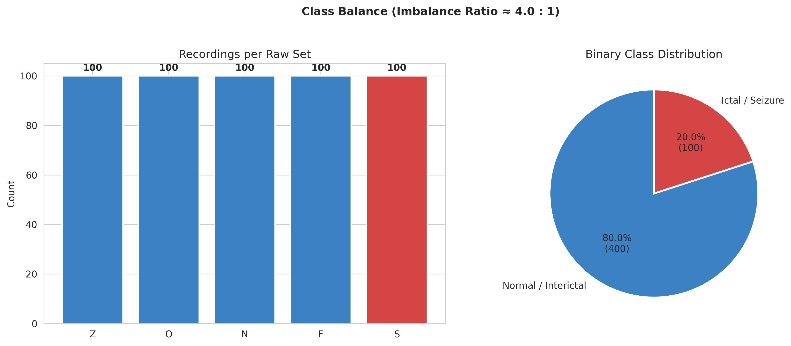
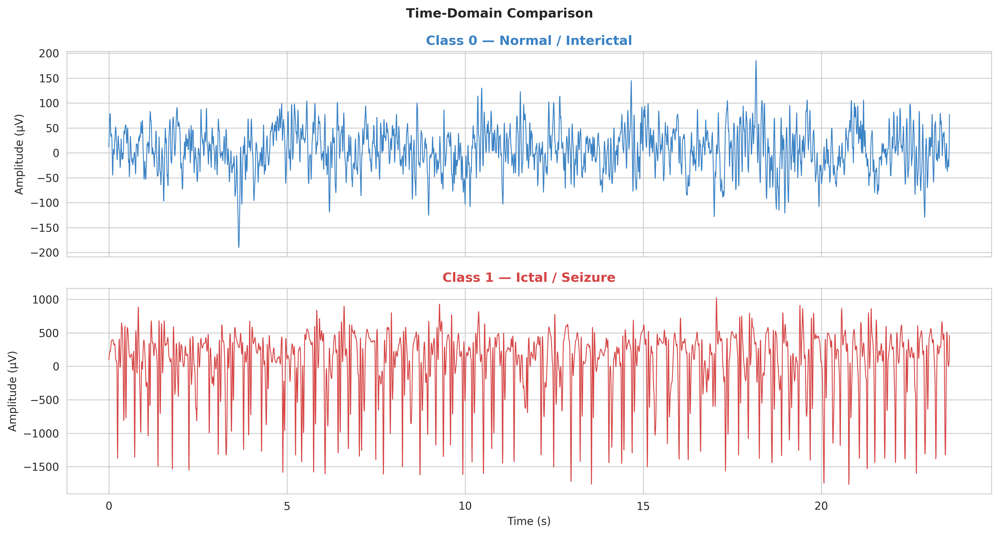
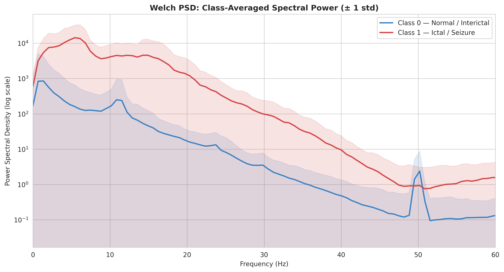
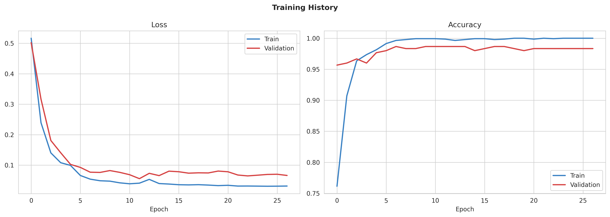
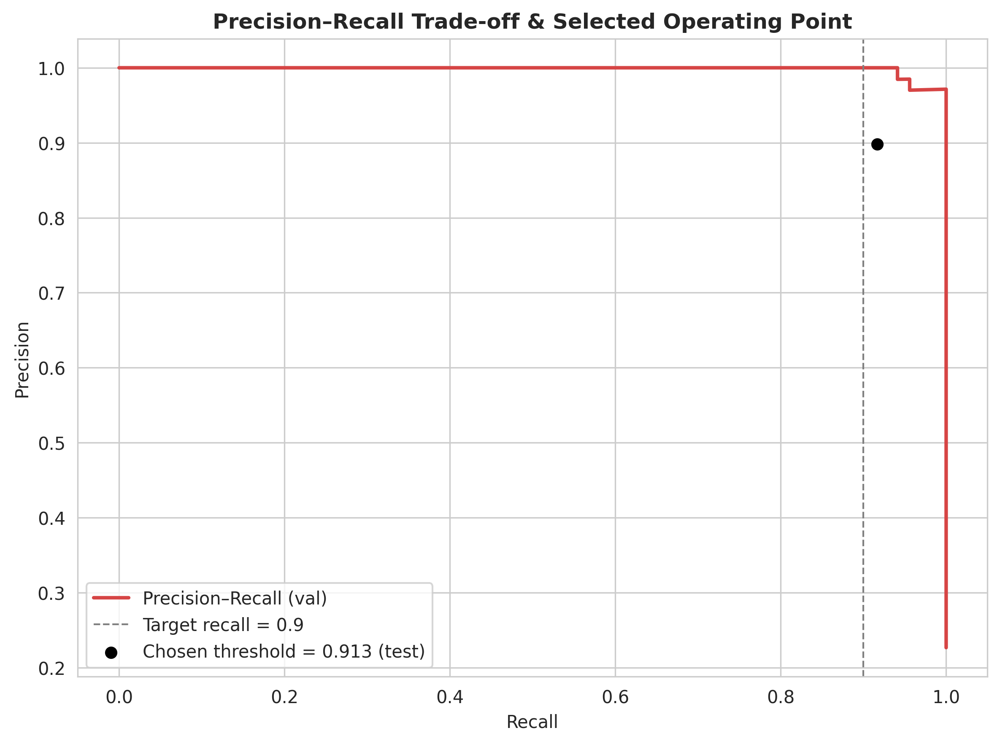
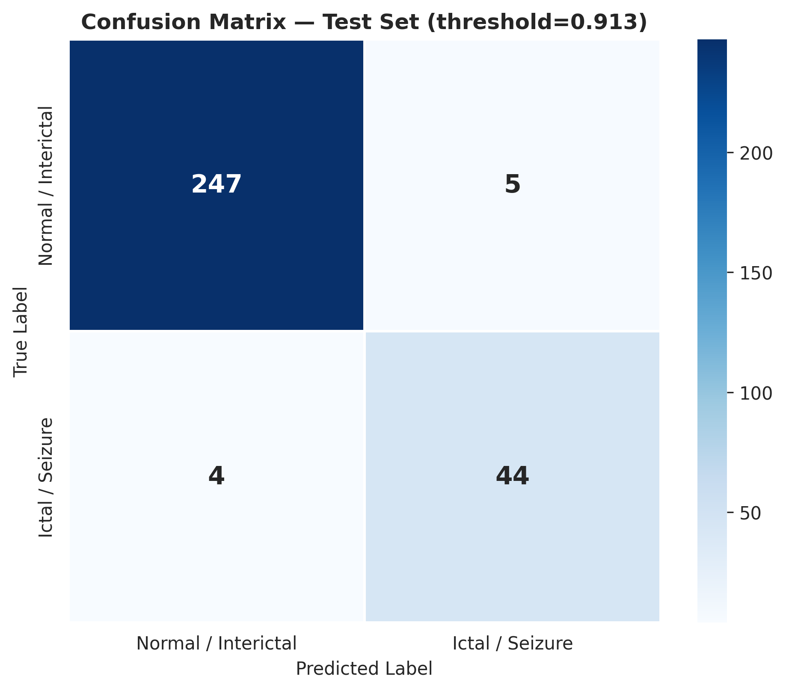
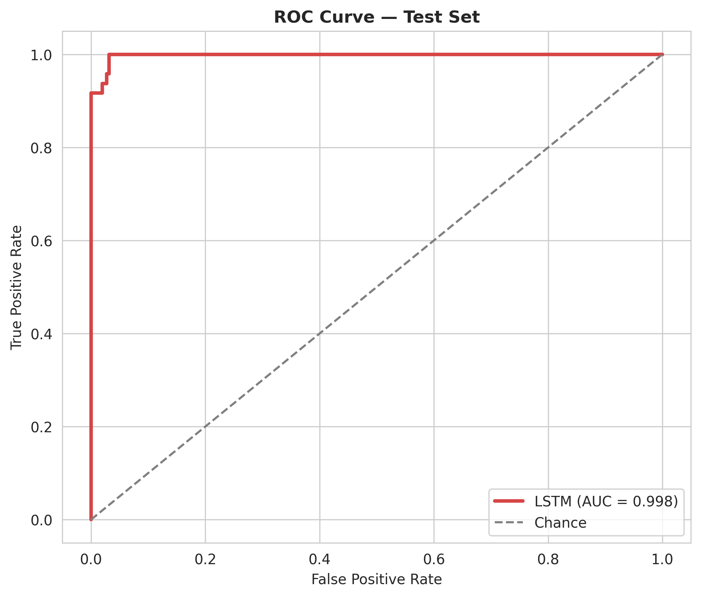

<div align="center">

# 🧠 DeepIctal-Bonn

**LSTM-based epileptic seizure detection on the Bonn University EEG dataset**

[](https://www.python.org/)
[](https://www.tensorflow.org/)
[](https://scikit-learn.org/)
[](LICENSE)

</div>

---

## Overview

DeepIctal-Bonn is a reproducible deep learning pipeline that classifies single-channel EEG
recordings from the **Bonn University EEG dataset** into **Normal/Interictal** and
**Ictal/Seizure** classes using a **Long Short-Term Memory (LSTM)** network.

The pipeline covers the full lifecycle: signal ingestion → windowed tensor construction →
leakage-safe grouped splitting → LSTM training with class-imbalance handling →
recall-oriented threshold tuning → evaluation → reporting.

📄 **For full methodology, derivations, and discussion, see the [complete report](reports/report.pdf).**

## Dataset & Class Mapping

| Class | Label | Bonn Set(s) | Description |
|:-----:|:-----:|:-----------:|:-------------|
| 🔴 Ictal / Seizure | `1` | **S** | Intracranial recordings during active seizure |
| 🟢 Normal / Interictal | `0` | **Z, O, N, F** | Healthy volunteers + seizure-free intracranial recordings |

- **Recordings:** 500 total (100 per set)
- **Class balance (recording-level):** 400 vs. 100 (≈ 4.0 : 1)
- **Sampling rate:** 173.61 Hz · **Duration:** ~23.6 s/recording (4097 points)

## Methodology (Summary)

1. **Windowing** — each recording is reshaped to `(23, 178)`, so the LSTM
   unrolls 23 steps instead of 4097, avoiding vanishing gradients.
2. **Micro-shift augmentation** — 4 crop offsets per recording, quadrupling the
   dataset to 2000 samples at a fixed class ratio.
3. **Grouped splitting** — `GroupShuffleSplit` keyed on recording ID keeps all crops of a
   recording in the same split, preventing leakage.
4. **Scaling** — `StandardScaler` fit on the training split only, applied to all splits.
5. **Class weighting** — computed `class_weight` passed to training to offset the imbalance.
6. **Threshold tuning** — the decision threshold is chosen on the validation set to reach a
   minimum recall of 0.9, since missed seizures carry a higher clinical cost
   than false alarms.

*(Full mathematical treatment and rationale in the [report](reports/report.pdf).)*

## Model Architecture

```
Input (23, 178)
   ├─ LSTM(64, return_sequences=True) + L2
   ├─ BatchNormalization + Dropout(0.35)
   ├─ LSTM(32) + L2
   ├─ BatchNormalization + Dropout(0.35)
   ├─ Dense(16, relu) + Dropout(0.2)
   └─ Dense(1, sigmoid) → P(Seizure)
```

- **Trainable parameters:** 75,553
- **Optimizer:** Adam (lr = 1e-3, `ReduceLROnPlateau`)
- **Loss:** Binary Cross-Entropy, class-weighted (`{"0": 0.627, "1": 2.465}`)
- **Regularization:** `EarlyStopping` (patience=15) + Dropout + L2

## Exploratory Data Analysis

| Class Distribution | Time-Domain Comparison |
|:---:|:---:|
|  |  |

| Power Spectral Density |
|:---:|
|  |

## Training & Evaluation

| Training Curves | Precision–Recall Trade-off |
|:---:|:---:|
|  |  |

| Confusion Matrix | ROC Curve |
|:---:|:---:|
|  |  |

### Test-Set Performance

Operating point tuned on the validation set for recall ≥ 0.9 (threshold = 0.913):

| Metric | Tuned Threshold | Default (0.5) |
|:-------|:---------------:|:--------------:|
| Accuracy | 97.00% | 97.00% |
| Precision | 89.80% | 88.24% |
| **Recall (Sensitivity)** | **91.67%** | 93.75% |
| F1-Score | 90.72% | 90.91% |
| ROC-AUC | 0.9977 | — |

Trained for 27 epochs (early-stopped); best validation loss 0.0556.

## Getting Started

```bash
# 1. Unzip the project and move into it
cd DeepIctal-Bonn

# 2. Install dependencies
pip install -r requirements.txt

# 3. Run the pipeline (data → training → evaluation)
python deepictal_bonn_pipeline.py
# ...or open the notebook:
jupyter notebook DeepIctal_Bonn.ipynb

# 4. Generate the README / LaTeX report / PDF from the results
python generate_docs.py
```


## Citation

> Andrzejak, R. G., Lehnertz, K., Mormann, F., Rieke, C., David, P., & Elger, C. E. (2001).
> Indications of nonlinear deterministic and finite-dimensional structures in time series
> of brain electrical activity: Dependence on recording region and brain state.
> *Physical Review E*, 64(6), 061907.

